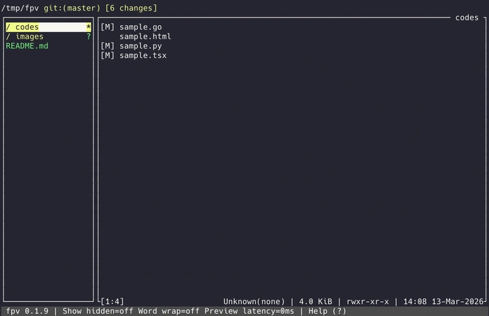

# fpv — Fast Previewer TUI
[](https://github.com/digicrafts/fpv/actions/workflows/release.yml)
[](https://github.com/digicrafts/fpv/stargazers)
[](https://github.com/digicrafts/fpv/releases)
[](LICENSE)

**fpv is the ultra-fast terminal-native file cockpit for code discovery.**  
Explore folders, preview files, and review diffs instantly without leaving your terminal workflow.

Built for speed and clarity, fpv delivers near-instant preview updates with an intentionally minimal UI: just a focused tree and preview, keyboard-first controls, and zero extra clutter.  
Under the hood, fpv is powered by [Ratatui](https://github.com/ratatui-org/ratatui) for responsive, terminal-native rendering.

Current release: `v0.1.12`

---



## Features

- **Split-pane power flow** — Keep context with a directory tree on the left and instant file preview on the right
- **Multi-language syntax highlighting** — Tree-sitter powered rendering for major languages (see [Supported file types](#supported-file-types))
- **Git-aware navigation** — Spot status and change intent directly in the tree and preview
- **Instant reload loop** — Navigate quickly with low-latency file switching and stable frame refresh
- **Minimal interface, maximal signal** — Minimal, focused chrome so diff and code content stay the center of attention
- **Inline diff-first reviews** — Toggle diff mode to surface added/removed lines inside the preview with visual markers in the scrollbar
- **Visual file previews** — See PNG, JPEG, and GIF content as compact ASCII art directly in the terminal, including proportional scaling
- **Fully customizable** — Tune key bindings and theme behavior with a simple TOML configuration
- **Reliable fallbacks** — Safe plain-text rendering for binaries or files that cannot be highlighted
- **Ratatui-powered** — Smooth, low-latency interface updates built on the Ratatui widget/rendering ecosystem
- **Preview-pane text search** — Find and jump to text matches inside the active file preview quickly.

## Installation

### Homebrew

```bash
brew tap digicrafts/tap
brew install fpv
```

### Ubuntu(APT)

```bash
curl -1sLf 'https://dl.cloudsmith.io/public/digicrafts/fpv/setup.deb.sh' | sudo -E bash
sudo apt install fpv
```

### From source

See [Build from source](#build-from-source) below.

## Usage

```bash
# Open current directory
fpv

# Open a specific path
fpv /path/to/project

# Use a custom config file
fpv /path/to/project --config ~/.config/fpv/config
```

**Quick tips: Press **?** in the app for shortcut help.

## Build from source

### Prerequisites

- [Rust](https://rustup.rs/) (Rust 1.70+)

### Build and run

```bash
git clone https://github.com/digicrafts/fpv.git
cd fpv
cargo build --release
```

The binary will be at `target/release/fpv`. Run it with:

```bash
./target/release/fpv
# or, if installed: fpv
```

To run without installing (e.g. for development):

```bash
cargo run -- /path/to/project
cargo run -- /path/to/project --config config/sample.user.toml
```

## Configuration

On first run, fpv creates a default config at:

- **Linux / macOS:** `~/.config/fpv/config`

You can override keybindings and theme there. Example `config`:

```toml
[mappings]
quit = "ctrl+q"
switch_focus = "ctrl+tab"

[theme]
directory_color = "yellow"
hidden_dim_enabled = true

status_display_mode = "bar"   # or "title"
```

Config keys under `[mappings]` include: `move_up`, `move_down`, `expand_node`, `collapse_node`, `open_node`, `exit_fullscreen_preview`, `switch_focus`, `page_up`, `page_down`, `preview_scroll_up`, `preview_scroll_down`, `toggle_preview_line_numbers`, `toggle_preview_wrap`, `toggle_help`, `toggle_hidden`, `resize_preview_narrower`, `resize_preview_wider`, `quit`. Use key names like `up`, `down`, `enter`, `tab`, `ctrl+q`, etc.

## Supported file types

Syntax highlighting is supported for:

| Category   | Extensions / names |
| ---------- | ------------------ |
| Shell      | `bash`, `sh`, `zsh`, `ksh` |
| C / C++    | `c`, `h`, `cpp`, `cxx`, `hpp`, `hxx` |
| Web        | `html`, `htm`, `css`, `xml` |
| Go         | `go` |
| Java       | `java` |
| JavaScript / TypeScript | `js`, `jsx`, `mjs`, `cjs`, `ts`, `tsx` |
| Data       | `json`, `toml`, `yaml`, `yml` |
| Markdown   | `md`, `markdown` |
| Python     | `py` |
| Rust       | `rs` |

Other files are shown as plain text or with a safe fallback.

## Roadmap

### Future planning features

| Planned feature | Completed |
| -------------- | --------- |
| In-preview search across text content | [✓] |
| Theme refinement and usability improvements | [ ] |
| Plugin architecture for extensible preview features | [ ] |
| Git graph view for commit history context | [ ] |

## Credits

fpv is built on the shoulders of open-source infrastructure:

- [Ratatui](https://github.com/ratatui-org/ratatui) — terminal UI framework that powers the full-screen rendering and interaction model.
- [Tree-sitter](https://tree-sitter.github.io/tree-sitter/) — fast language parsing for syntax highlighting support.
- The Rust terminal tooling and open-source contributors behind the ecosystem.

## License

This project is licensed under the MIT License. See [LICENSE](LICENSE) for details.
